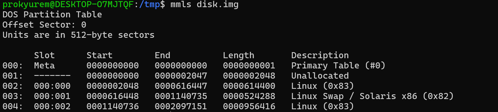
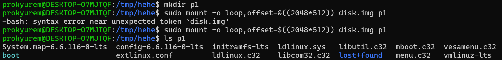
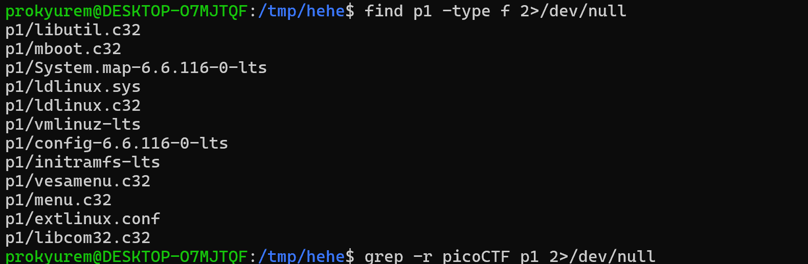
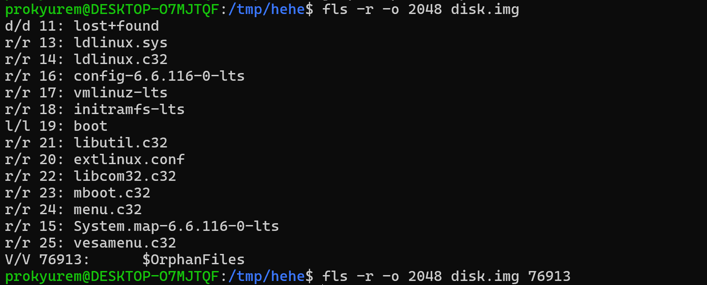
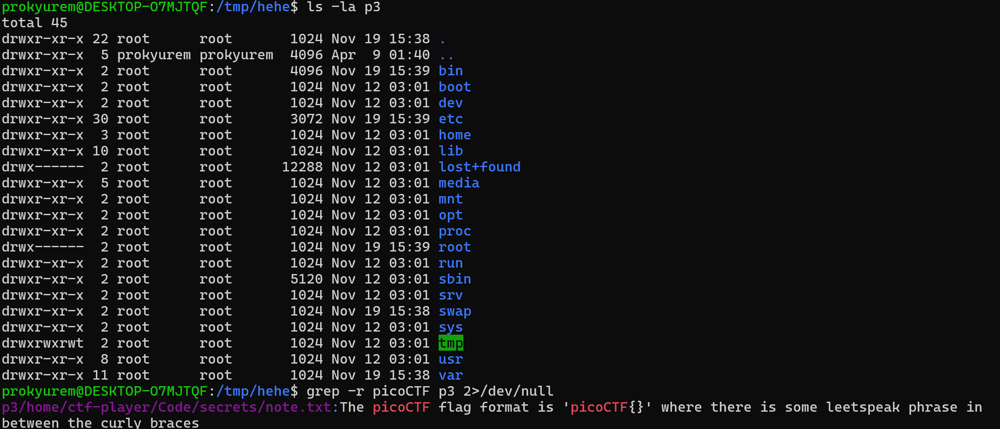
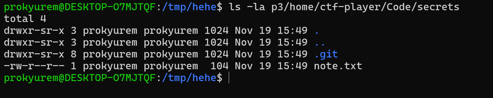
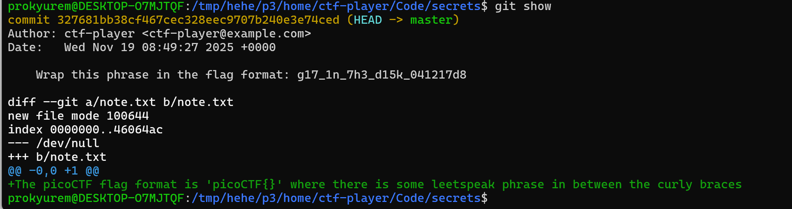
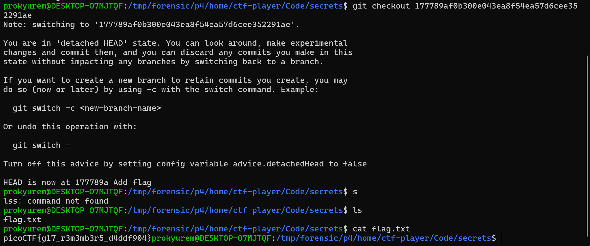

**Forensic**

Sau khi biết được các phân vùng, ta thấy rằng có 2 phân vùng có khả năng có flag là 001 và 004 

Trước hết ta khai thác phân vùng 001 

Ta dùng lệnh mount để gán 1 partition vào thư mục p1, sau đó dùng lệnh ls để liệt kê các file có trong đây 

Tiếp theo ta thử dùng lệnh find để liệt kê tất cả các file xem có file gì đáng ngờ không 
Khi không có file gì đáng ngờ ta thử dùng lệnh grep để tìm nhanh xem có flag không và kết quả là không hiện gì 

Dùng lệnh fls để xem các file đã bị xóa xem có gì đáng ngờ không, nhưng không có gì đáng ngờ cả, ta chuyển sang thử ở phân vùng 003 

Ta đã thấy dấu hiệu ở file "p3/home/ctf-player/Code/secrets/note.txt" 
Ta sẽ truy cập đến file đó xem có gì không 

Khi ta liệt kê tất cả các file của thư mục thì thấy file "git" 
Ta đọc file git này và có được flag

Với dạng bài mà dev đã add flag nhưng sau đó remove đi thì git không xóa thật mà commit mới đã ghi đè, data cũ vẫn còn trong history, ta chỉ cần checkout commit cũ bằng lệnh 
 