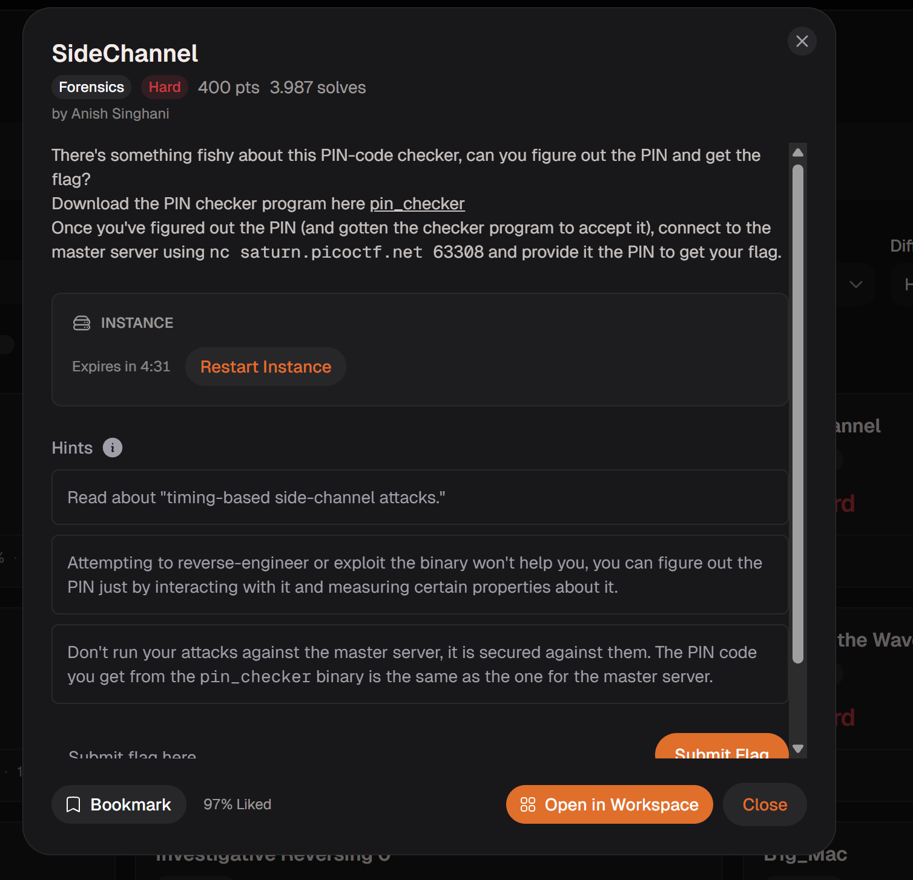
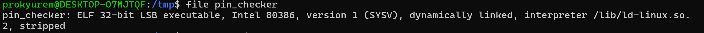
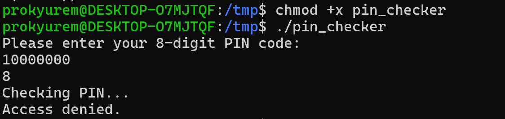
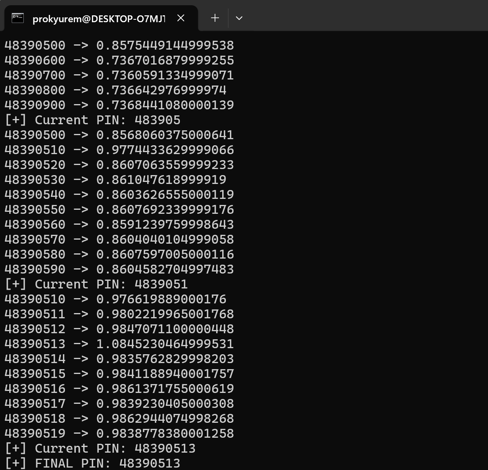
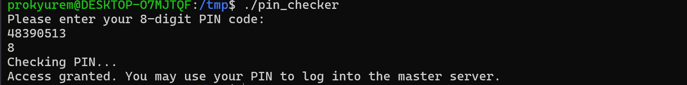
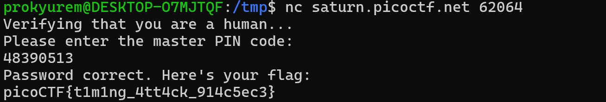

**Forensic**

Đây là đề bài 

Mục tiêu: Tìm ra được PIN-code sau đó thực hiện nhập PIN-code đó khi kết nối nc là nhận được flag 

Đầu tiên ta thử xem file đề bài cho là dạng gì  

Đó là file thực thi của Linux

Ta cấp quyền cho file rồi chạy để xem file chạy như nào 

Ta nhận thấy khi chạy file ta sẽ được yêu cầu nhập 1 mã PIN 8 chữ số 

Từ gợi ý của đề bài là "đọc về tấn công phụ thuộc vào thời gian"

Tức là ta sẽ tìm ra mã PIN bằng cách dựa vào thời gian trả về của mã PIN khi ta nhập để xác định đâu là mã PIN đúng 

Lý do là bởi vì mã PIN có 8 chữ số thì nếu mình nhập số đầu tiên đúng thì thời gian response sẽ lâu hơn vì ứng dụng sẽ phải check số tiếp theo, còn nếu số đầu tiên sai thì thời gian response sẽ lâu hơn 

Như vậy, ta sẽ brute_force từng chữ số 1 để tìm ra PIN-code đúng 

Code python: 

import subprocess
import time
import statistics

PIN_LEN = 8
CHARSET = "0123456789"

pin = ""

for pos in range(PIN_LEN):

    results = []

    for ch in CHARSET:

        guess = pin + ch + "0" * (PIN_LEN - len(pin) - 1)

        timings = []

        for _ in range(30):

            start = time.perf_counter()

            subprocess.run(
                ["./pin_checker"],
                input=(guess + "\n").encode(),
                stdout=subprocess.DEVNULL,
                stderr=subprocess.DEVNULL
            )

            end = time.perf_counter()

            timings.append(end - start)

        avg = statistics.median(timings)

        results.append((avg, ch))

        print(f"{guess} -> {avg}")

    results.sort(reverse=True)

    best = results[0][1]

    pin += best

    print(f"[+] Current PIN: {pin}")

print(f"[+] FINAL PIN: {pin}")

Sau khi chạy xong ta nhận được PIN-code 

Ta thử nhập 

-> Như vậy đã bypass thành công 

Ta nhận được flag 

