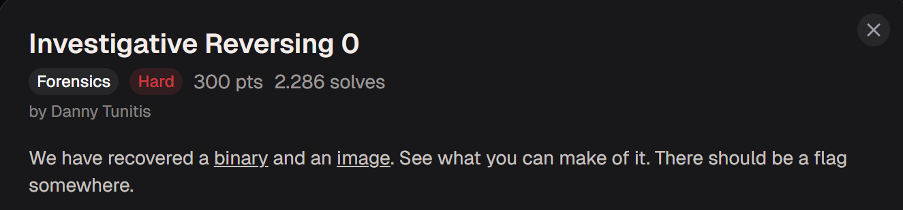
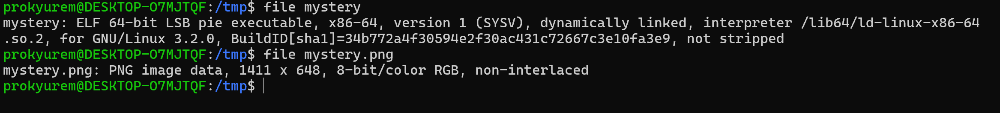
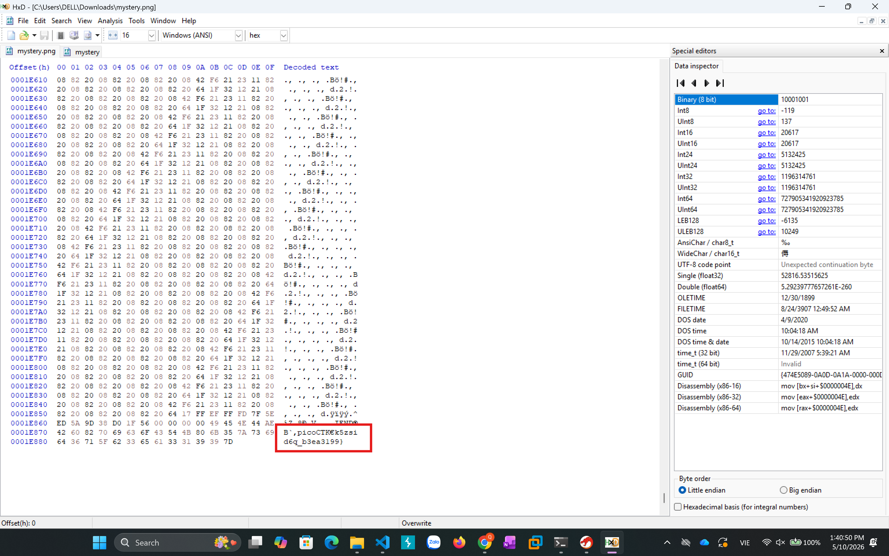
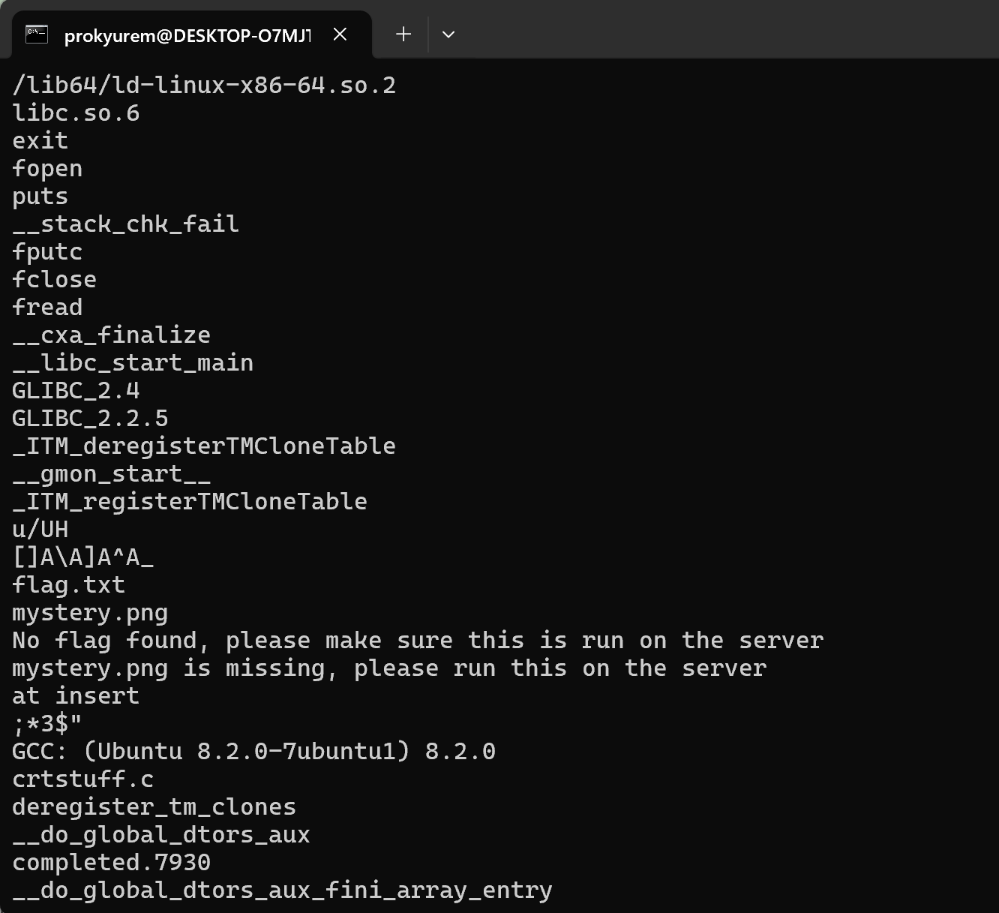
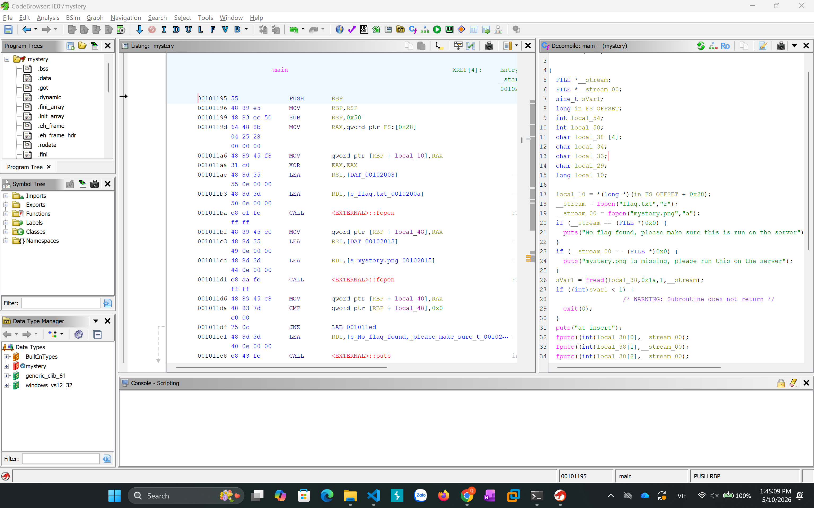
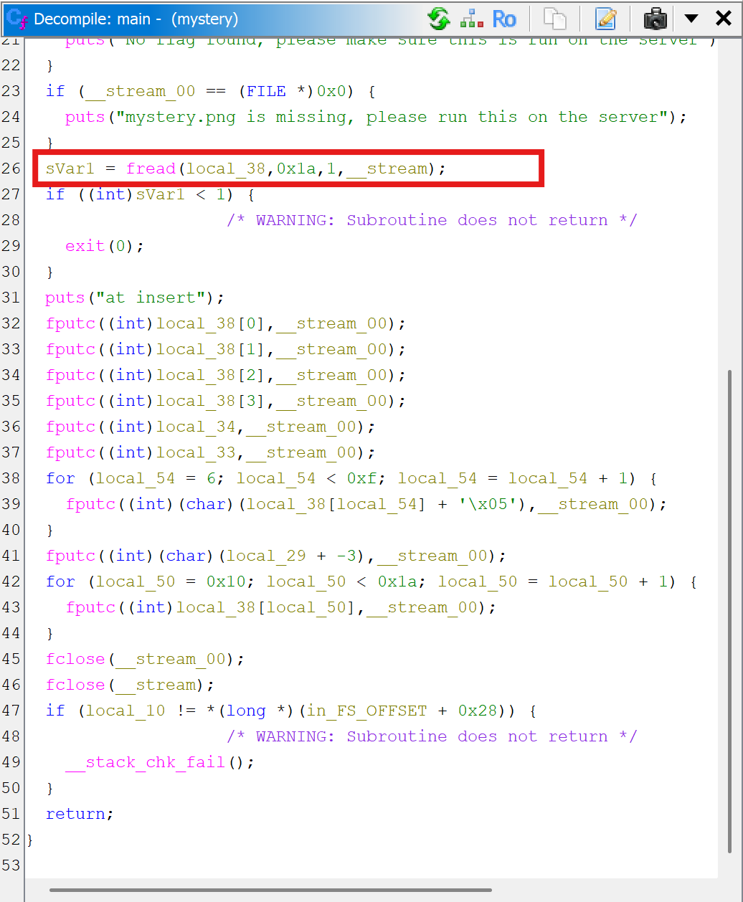
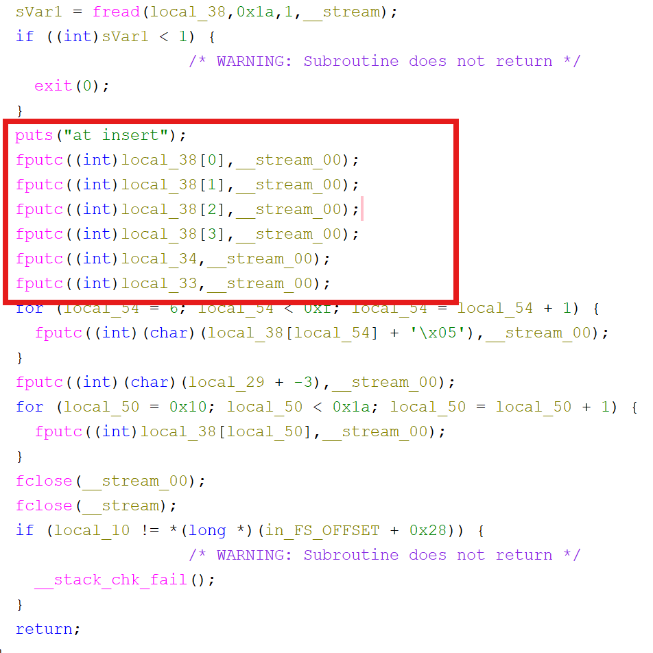
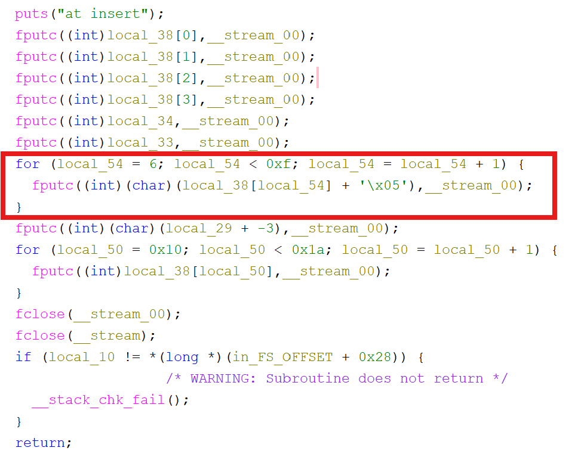
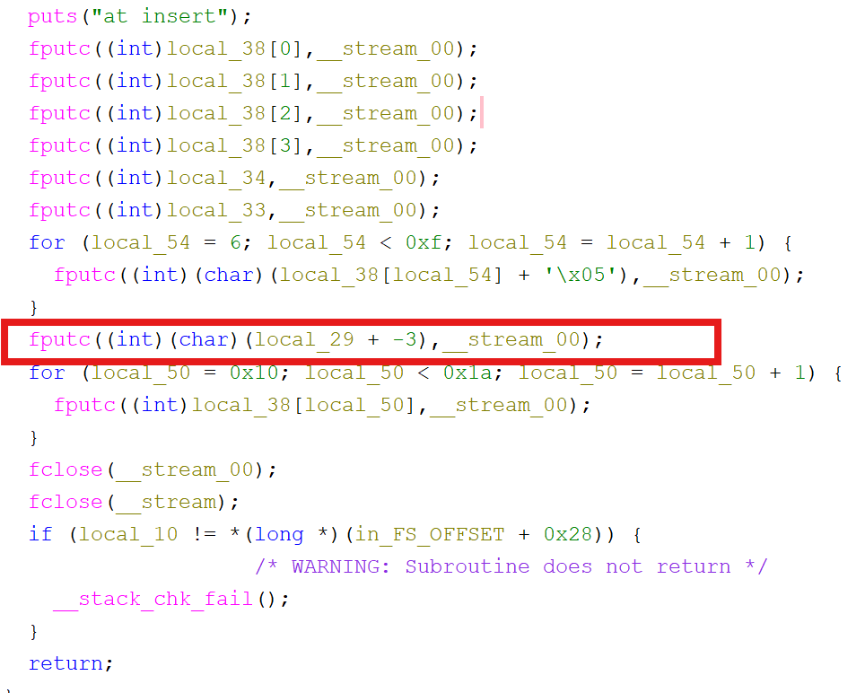
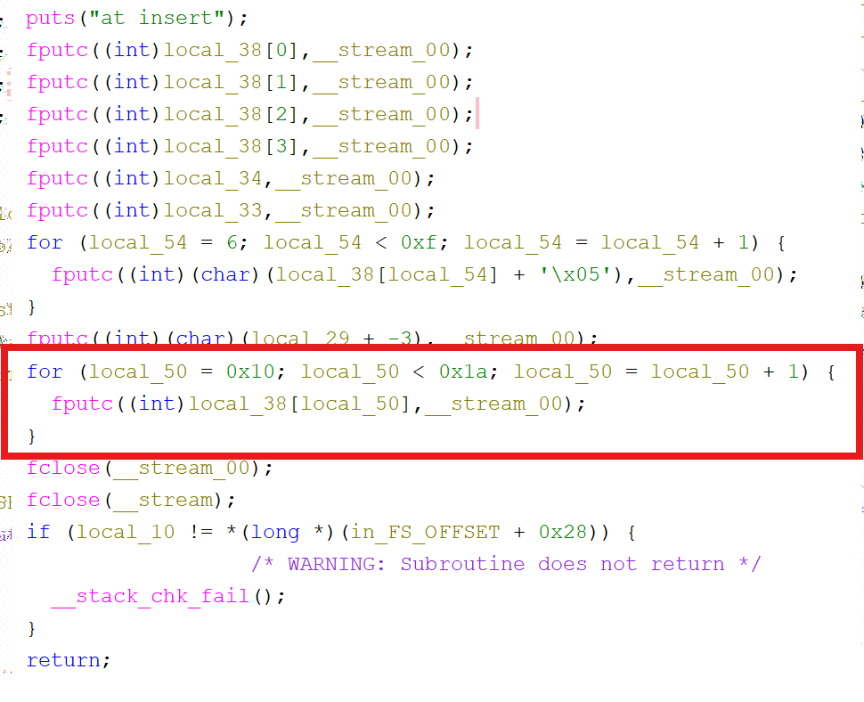

**Forensic**

picoCTF: Investigative Reversing 0: Hard 

Ở bài này ta nhận được 1 file binary và 1 file image 



Ta kiểm tra định dạng file của 2 file này thì ta thấy

mystery là file thực thi của Linux 

mystery là file png 



Ta thử đọc header của file png thì thấy 



Đoạn này có định dạng giống flag : picoCTK€k5zsid6q_b3ea3199}

Ta có thể nhận thấy dữ liệu về flag đã bị biến đổi 

Giờ ta sẽ khai thác file mystery kia 

Khi ta dùng strings mystery thì ta thấy 



Điều này cho thấy có file flag.txt, binary đọc flag rồi xử lý 

Ta sẽ dùng Ghidra để phân tích 



Ở đoạn này : ```__stream = fopen("flag.txt","r");```
             ```__stream_00 = fopen("mystery.png","a");```

Ý nghĩa: mở flag.txt sau đó mở mystery.png rồi append dữ liệu vào cuối file png



Ý nghĩa: Ứng dụng thực thi đọc flag 

Prototype: fread(buffer, size, count, file);

Ở đây size = 0x1a = 26 
=> đọc 26 byte từ flag.txt 



Ý nghĩa: 6 byte đầu được ghi nguyên vẹn, không mã hóa 

Tức là: picoCT 



Giải thích:

Encode: cipher = original + 5 

Decode: origianl = cipher - 5

Decode thành: F{f0und_1



Giải thích: 

Encode: cipher = original - 3

Decode: original = cipher + 3

Decode thành: t 



Các byte còn lại được giữ nguyên 

Sau khi ghép ta được flag là: picoCTF{f0und_1t_b3ea3199}

