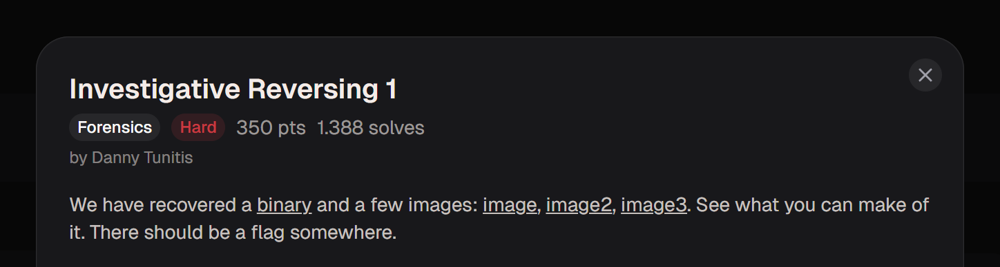
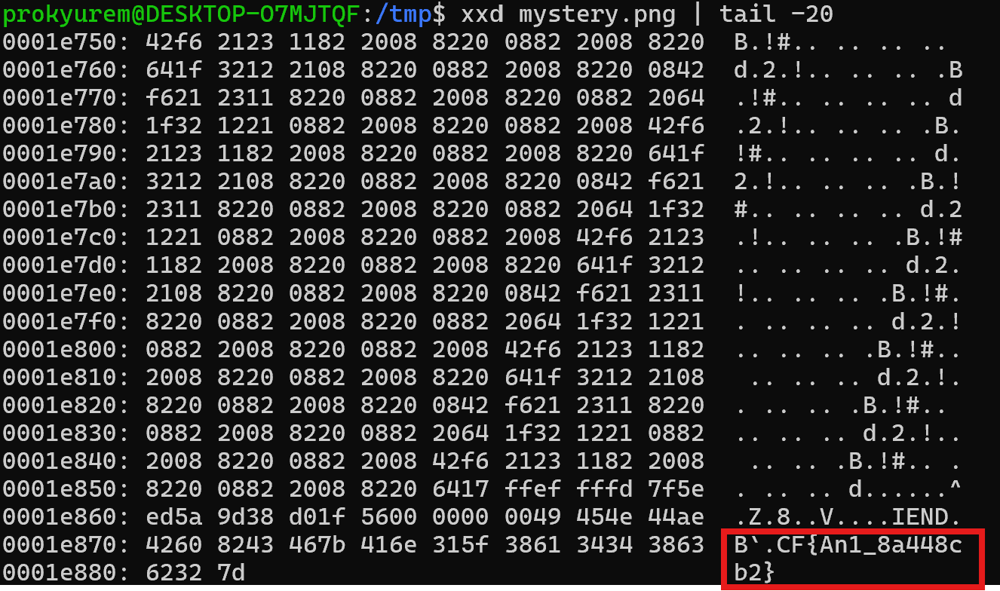
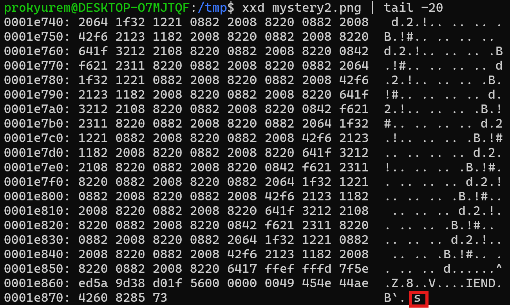
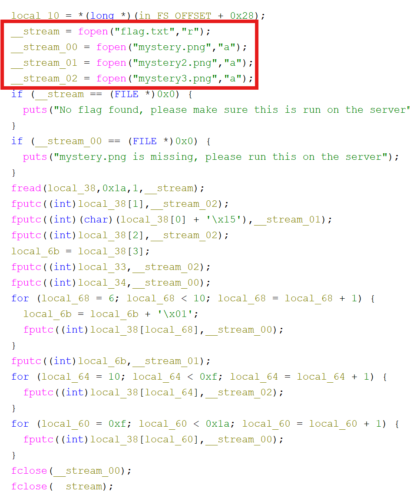
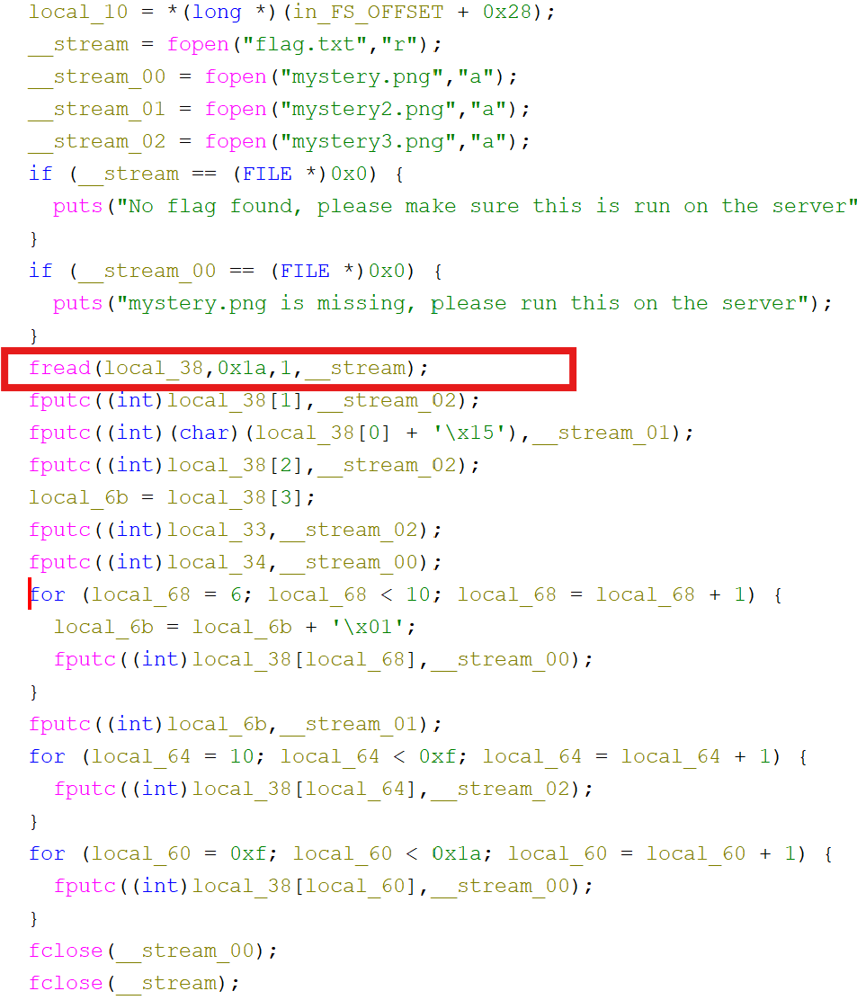
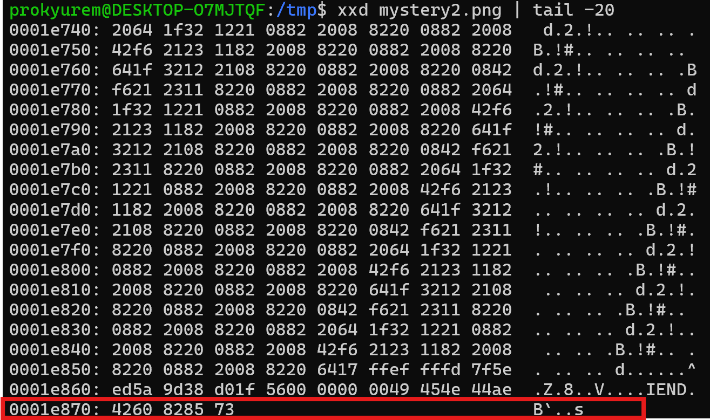
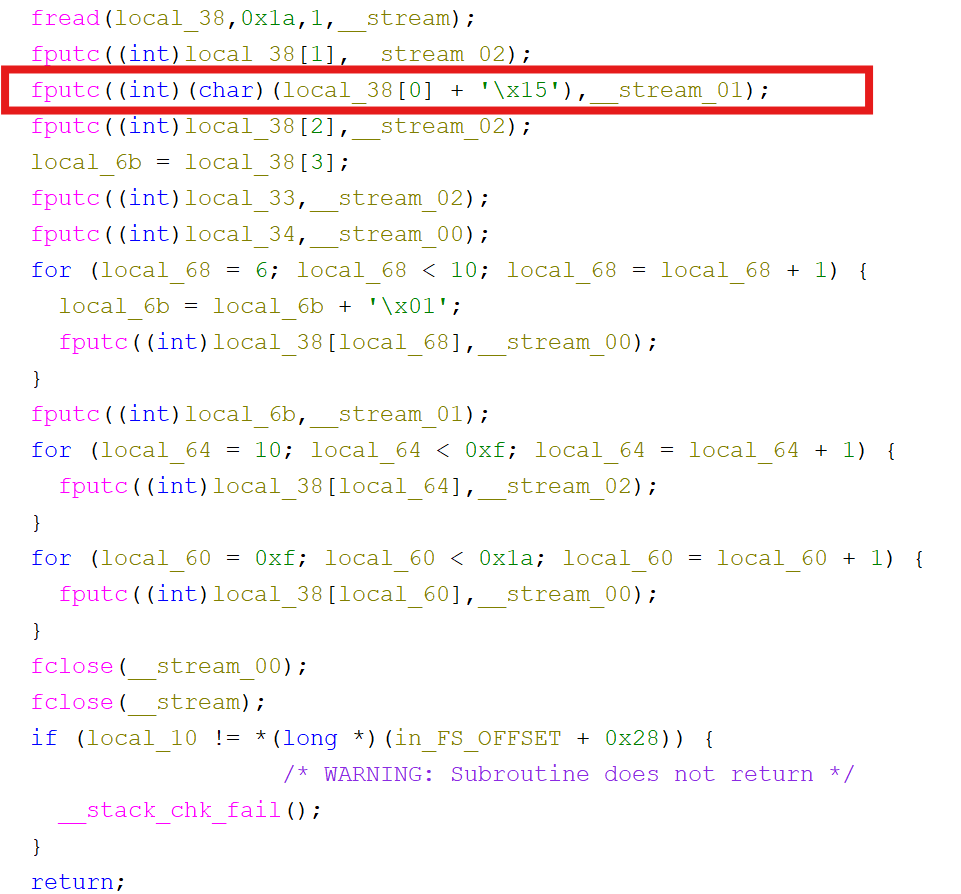
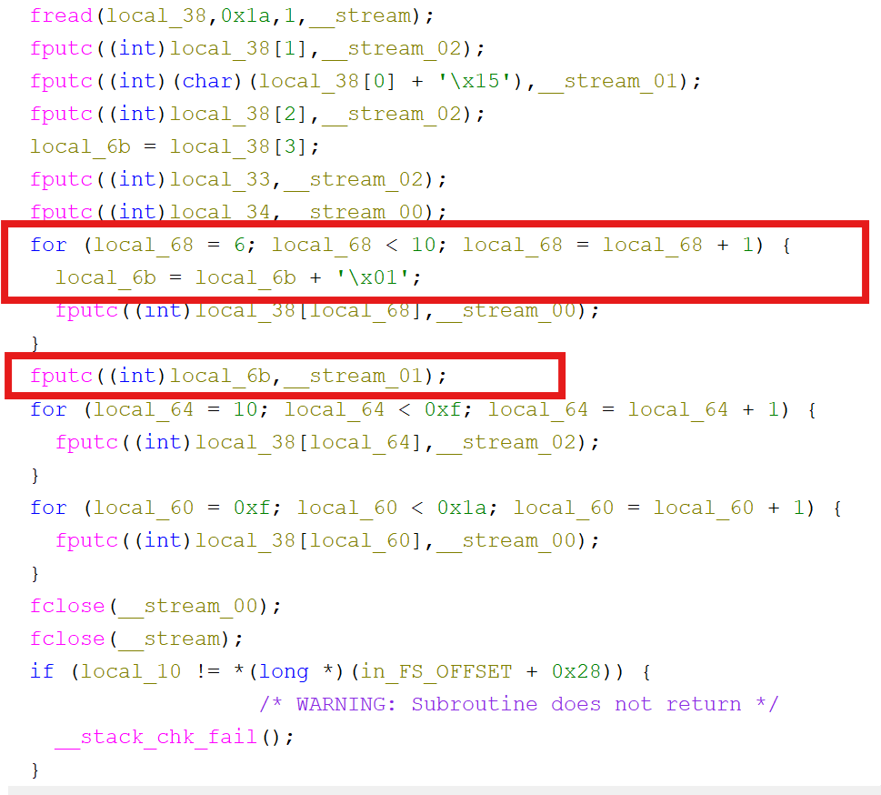
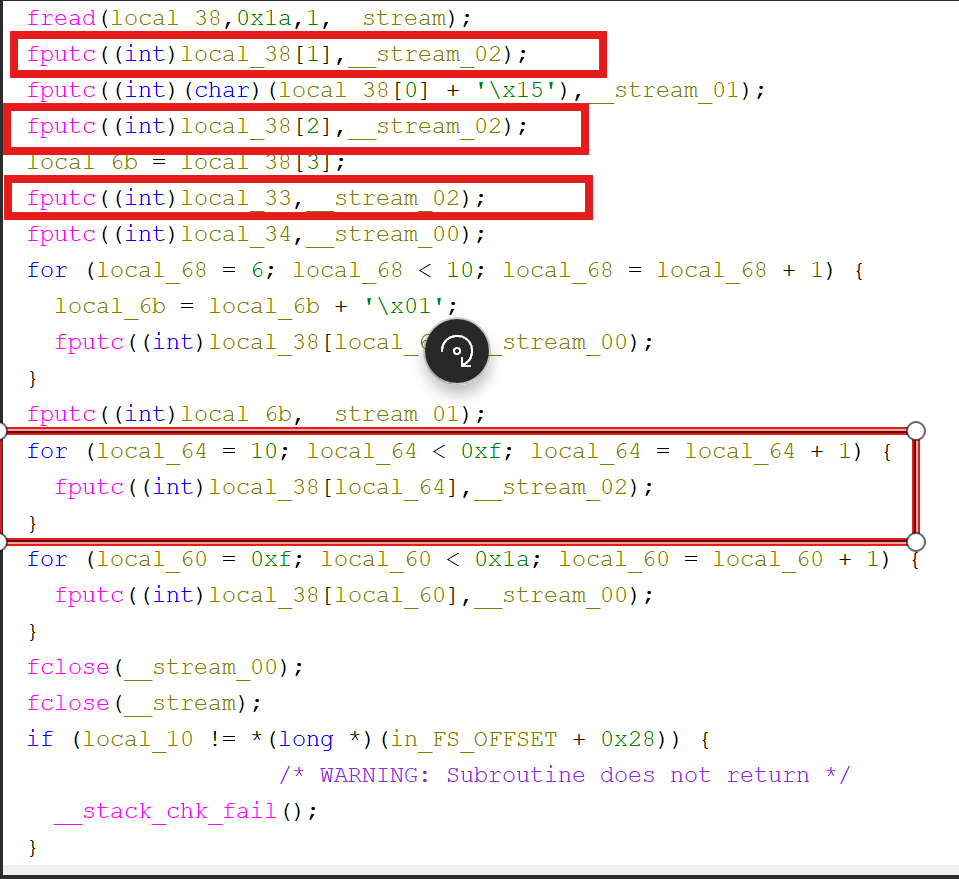
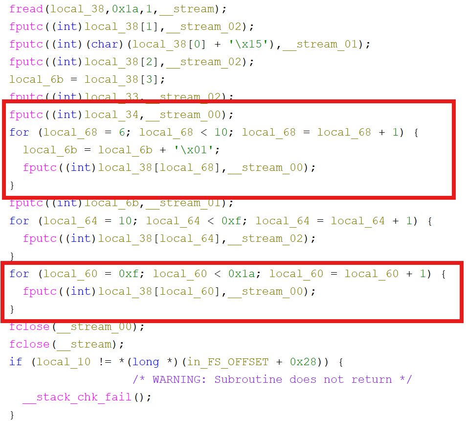

**Forensic**

picoCTF: Investigative Reversing 1: Hard 

Ở bài này ta nhận được 1 file binary và 3 file png 

Bài này khá giống bài trước nên ta sẽ kiểm tra phàn header cuối của 3 ảnh đề cho 

Với ảnh đầu tiên thì ta thu được dữ liệu là: CF{An1_8a448cb2}

Với ảnh thứ 2 thì ta thu dược dữ liệu là: s 

![alt text]images/image-3.png)

Với ảnh thứ 3 thì ta thu được dữ liệu là: icT0tha_

Lúc này ta nhận ra dữ liệu flag đã bị chia thành 3 phần và nhiệm vụ của ta là cần reverse và ghép lại

Tiếp theo ta sẽ dùng tool Ghidra để xem cách dữ liệu được xử lý như nào 

Giải thích:

- Mở file flag để đọc 

- Mở các file png và append dữ liệu vào cuối file 

    

Binary đọc 26 byte từ flag.txt 

Phân tích mystery2.png 

3 byte đầu là PNG footer nên dữ liệu append bắt đầu từ 85 73  

Giải thích: cipher = original + 0x15

Dữ liệu trong file: 0x85 

=> original = 0x85 - 0x15 = 0x70 chuyển sanng mã ASCII là: p

Ở đoạn code tiếp theo :

Loop chạy 4 lần 

=> cipher = original + 4 

Dữ liệu trong file: 's' 

=> original = 's' - 4 = 'o'

=> flag[0] = p, flag =[3] = o 

Ở đoạn code tiếp theo: 

Binary ghi trực tiếp: flag[1], flag[2], flag[5], flag[10], flag[11], flag[12], flag[13], flag[14] mà không mã hóa 

Dữ liệu thu được là: icT0tha_

Ở đoạn code tiếp theo:

Binary ghi: flag[4], flag[6..9], flag[15..25] mà không mã hóa

Dữ liệu thu được là: CF{An1_8a448cb2}

Ghép lại toàn bộ dữ liệu ta thu được:   picoCTF{An0tha_1_8a448cb2}

