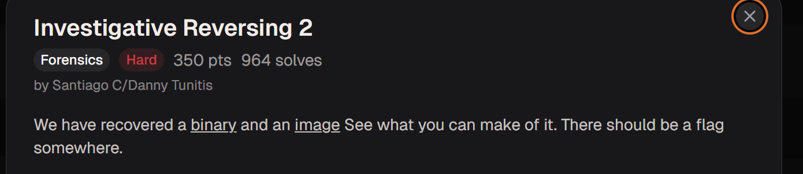
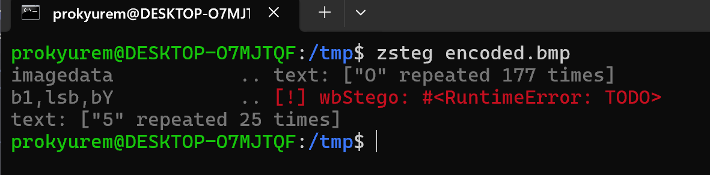
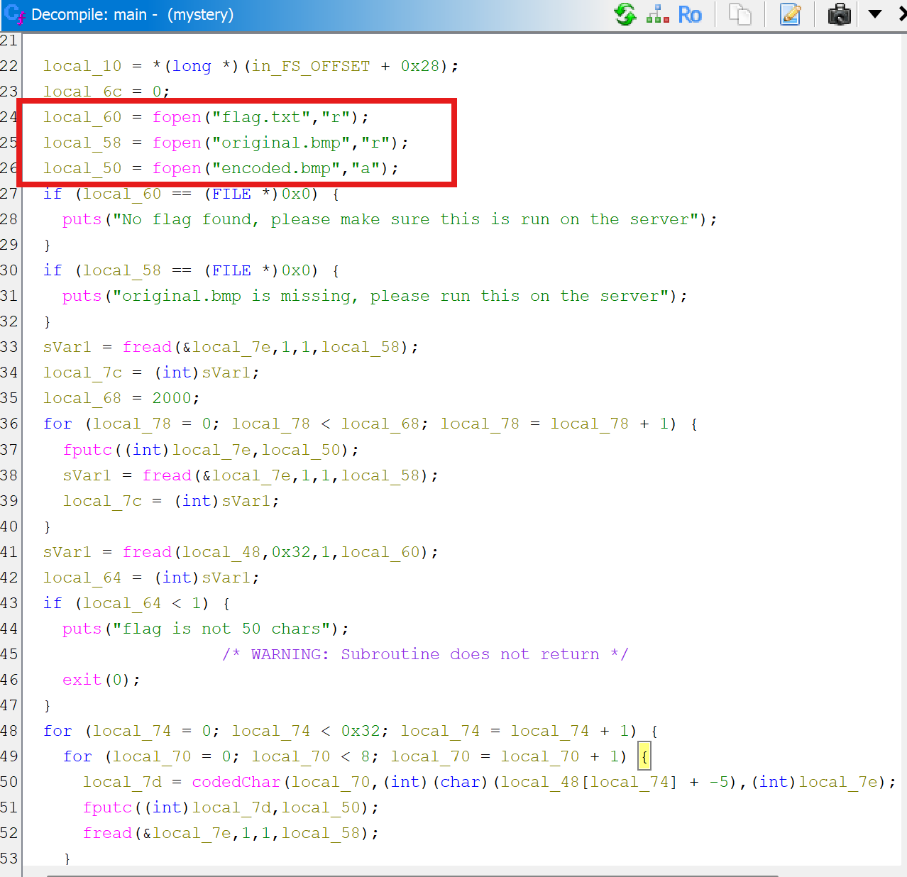
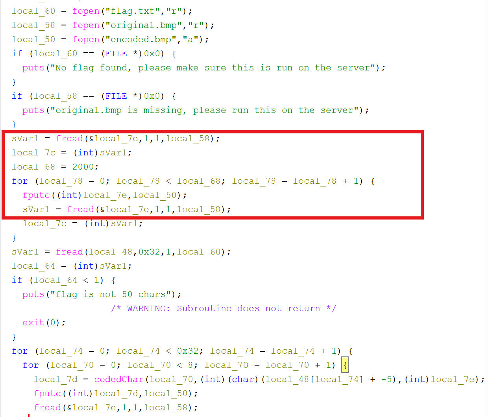
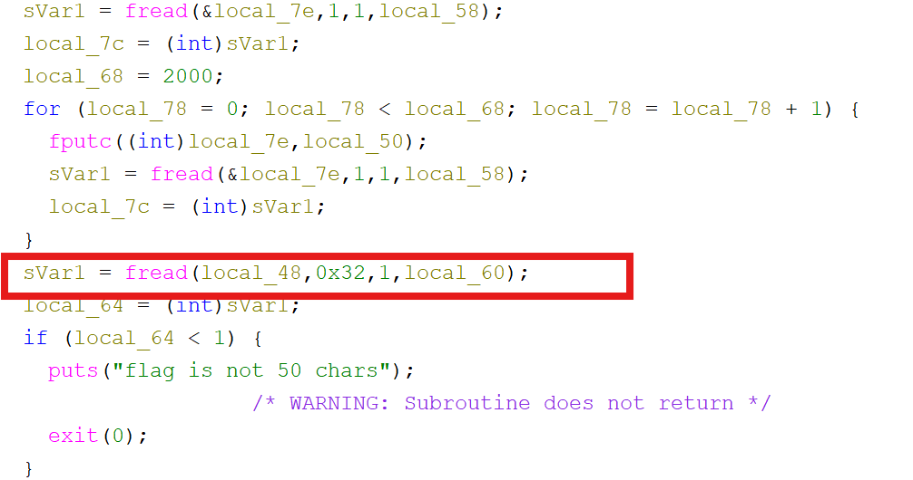
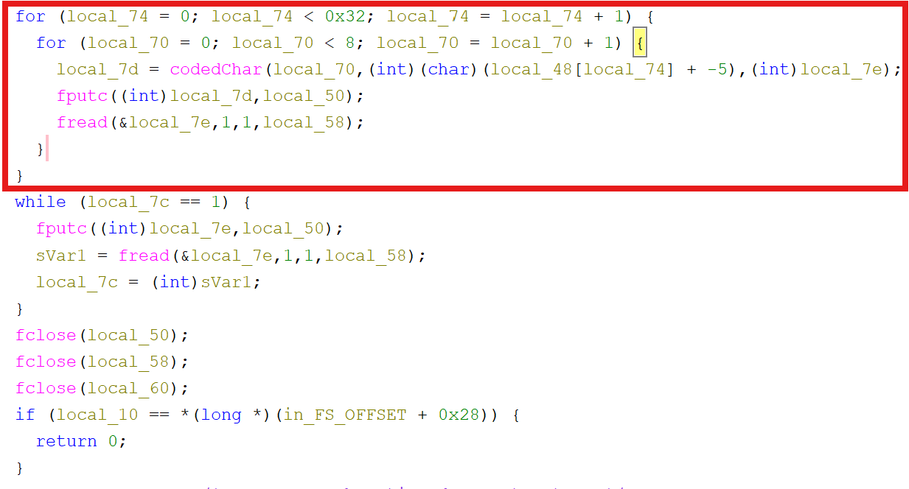

**Forensic**

picoCTF: Investigative Reversing 2: Hard

Ở bài này ta nhận được 1 file binary và 1 file image 

Đầu tiên ta sẽ phân tích file image 

Ta sẽ dùng zsteg để kiểm tra:

   

Kết quả:

- Không thu được gì trực tiếp 

Đọc tên file là encode.bmp ta hiểu rằng 

- Có dữ liệu được nhúng trong ảnh 

- Và đã bị encode 

-> Mục tiêu của mình sẽ là decode và từ dó thu thập được flag 

Vì challenge có cho mình file binary nên mình sẽ dùng tool Ghidra để hiểu cơ chế encode

Chức năng chương trình:

- Đọc file flag.txt
- Đọc file original.bmp
- Tạo file encoded.bmp

Ý nghĩa: 

- Đọc từng byte từ original.bmp 
- Ghi nguyên sang encode.bmp
- Thực hiện 2000 lần 

=> 2000 byte đầu tiên của ảnh không thay đổi

0x32 = 50 

=> Đọc 50 byte từ flag.txt 

Ý nghĩa đoạn code:

Vòng lặp ngoài: for (local_74 = 0; local_74 < 0x32; local_74++)

Tức là duyệt từng ký tự của flag 

Trừ 5 trước khi encode: (local_48[local_74] + -5)

Vòng lặp bit: for (local_70 = 0; local_70 < 8; local_70++)

Mỗi ký tự có 8 bit => Mỗi ký tự được encode thành 8 byte ảnh 

Hàm codedChar(...) dùng để sử byte ảnh 

Ý tưởng: 

- Lấy bit cuối cùng của byte ảnh thay bằng dữ liệu cần giấu 

Ví dụ: Byte ảnh: 10110010 LSB = 0

Muốn nhét bit 1 => 10110011 

Binary copy nguyên 2000 byte đầu, sau đó mới encode flag 

=> dữ liệu hidden bắt đầu tại: offset 2000

Flag có 50 ký tự, mỗi ký tự 8 bit, dùng 8 byte BMP => tổng 50 * 8 = 400 bytes 

=> vùng dữ liệu: 2000 -> 2399

Ta viết script để decode 

